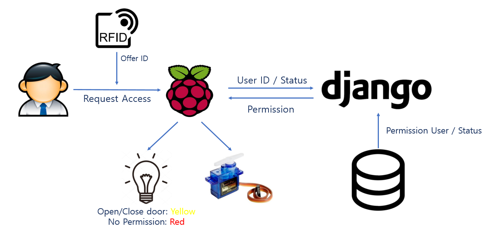

# Warm-up Team Project   : Client/Server Programming using Web
## RFID project
   * Rasqberry pi와 사용할 수 있는 RFID를 사용하여, 일종의 본인 인증시스템 구현을 목적으로 한다.
     서랍, 캐비넷과 같이 본인이 아니면 열 수 없게하여 보안을 유지한다.
   * (보류)또한 Key를 분실, 도난 당했을 경우를 생각해 열고 닫힌 이력을 확인할 수 있다.

### 시스템 구성도

### 작품 기능
  * 권한이 허락된 키가 아닐 경우
    * 문이 열리지 않으며(모터가 작동하지 않으며) 빨간불빛이 켜진다.
  * 권한이 허락된 키일 경우
    * 문이 열리며, 노란불빛이 켜진다.
 
 
